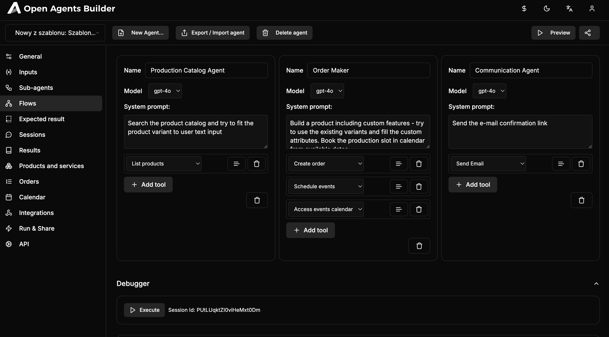
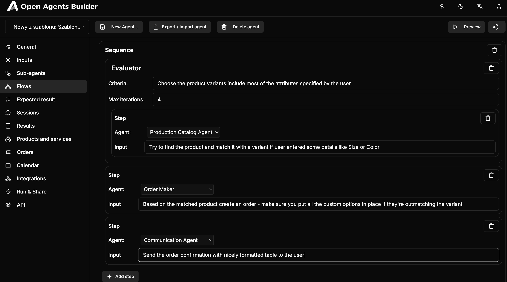
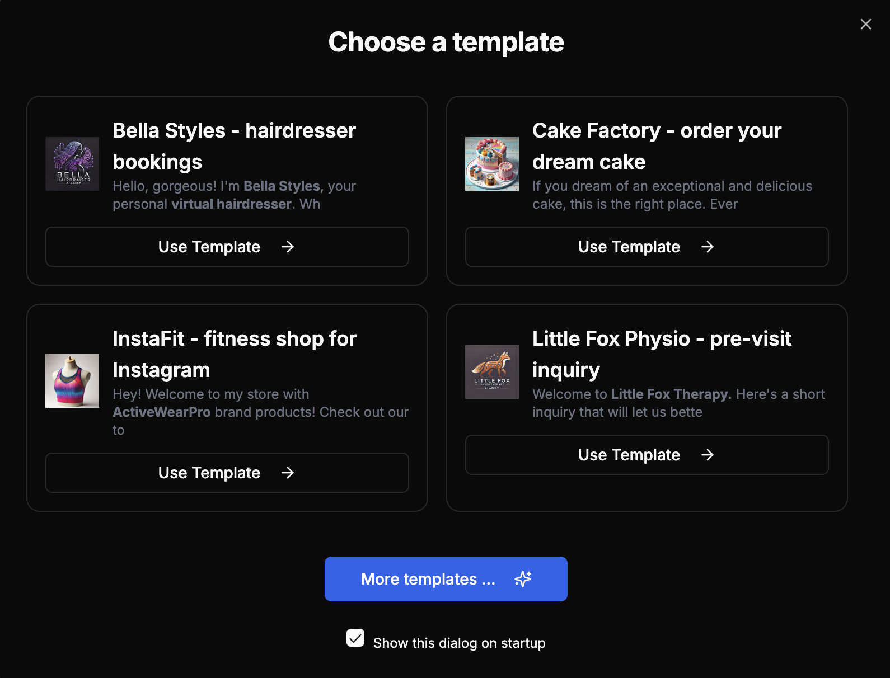
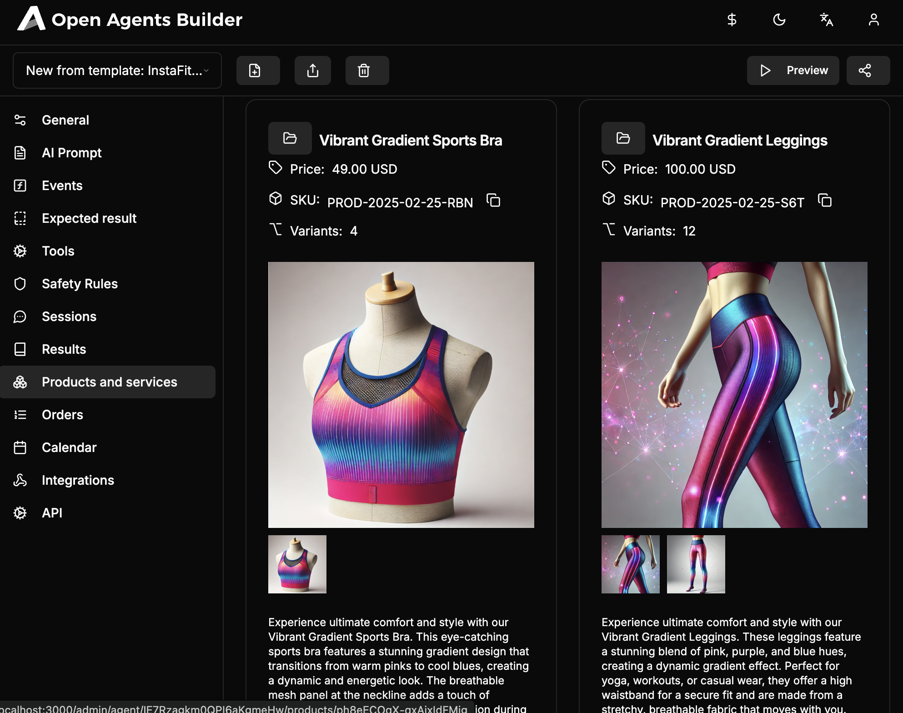
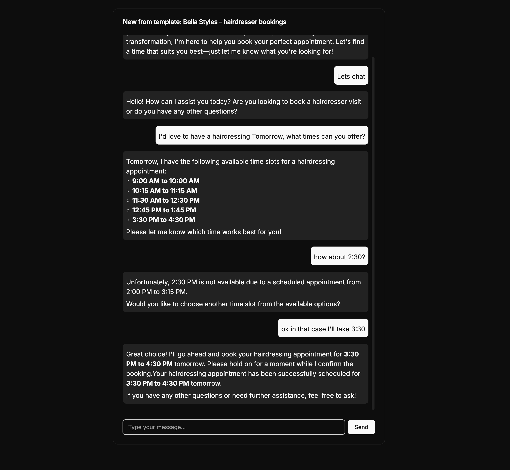
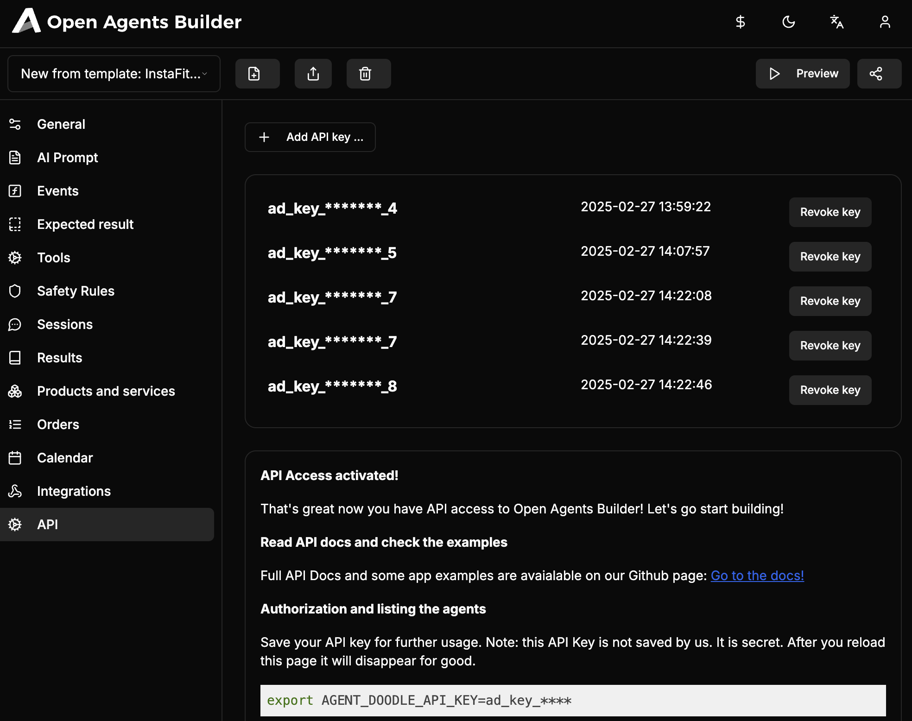
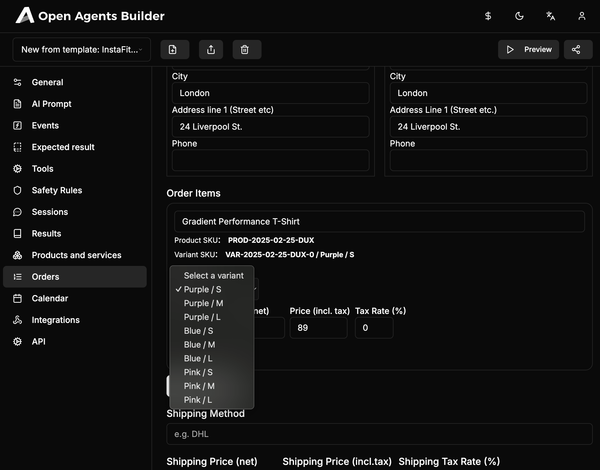

## Multi-Agent Development IDE and Platform for Business

Open Agents Builder is an Enterprise Grade AI Agents development platform:

- 💾 Design effective multi-agent workflows based on composable building blocks: `oneOf`, `parallel`, `sequence`, `evaluator`, `forEach`. [Read more at Anthropic blog...](https://www.anthropic.com/engineering/building-effective-agents)
- 🕸️ Publish the flows as API,
- 📆 All business features like: **Order Managemnt (OMS), Product Information (PIM), CPQ, Customers, Bookings/Calendar, Custom Entitie**s - all included within UI,
- 👩🏽‍💻 Use Open Agents Builder as an **App Backend** - full API support for any type of entities managable in the backend,
- 🔧 Use Vercel AI tools  to integrate 3rd party systems and give the AI business services (like `createOrderTool`, `createCalendarEventTool`, `listProductsTool`, vector DB support - **all basic tools are included***)
- 🛠️ Enterprise features like **audit logs, permissions, sharing, data encryption** are all included
- 👩‍💼 **Customer facing apps** support - by the interactive Chat interface - included,
- **API keys management, permissions, statistics** - all the features enterprises like - included.


💵 **Production grade Business Agents** within hours. With Open Agents Builder you are able to build the fully fledge POC (Proof of Concept) app for your Business Stakeholders **within hours, not days**.

## Making the **Enterprise** Hackers and Business users worlds met.

### Hackers?
Design the flows visually and then integrate it via API with your existing apps or generate the TypeScript code for [flows-ai](https://github.com/callstackincubator/flows-ai)


<table>
    <tr>
        <td>
            <a href=".readme-assets/screenshot-oab-2.png">
                
            </a>
        </td>
        <td>
            <a href=".readme-assets/screenshot-oab-1.png">
                
            </a>
        </td>
    </tr>
</table>

### Business users?
Cooperate with developers - all your business logic changes (using natural language) are immediately available via API!

Create a customer facing agent, get a unique link, send it to the users or call it via API! 


<table>
    <tr>
        <td>
            <a href=".readme-assets/screenshot-oab-3.png">
                
            </a>
        </td>
        <td>
            <a href=".readme-assets/screenshot-oab-4.png">
                
            </a>
        </td>
        <td>
            <a href=".readme-assets/screenshot-oab-5.png">
                
            </a>
        </td>
    </tr>
    <tr>
        <td>
            <a href=".readme-assets/screenshot-oab-6.png">
                
            </a>
        </td>
        <td>
            <a href=".readme-assets/screenshot-oab-7.png">
                
            </a>
        </td>
        <td>
            <a href=".readme-assets/screenshot-oab-8.png">
                
            </a>
        </td>
    </tr>    
</table>

## Build AI Agents for Business: Bookings, Intake forms, Orders, Support, Integrations ....

Open Agents Builder let you create custom AI agents for Business. You can create the **customer facing** agents or **complex business workflows** that:

- 💵 can sell things on Instagram,
- ✏️ can integrate all sort of business systems - ERP, PIM, CRM
- 🛠️ can configure sophisticated products (CPQ),
- 💁‍♀️ automates your Company and **saves you tons of time** and money otherwise spend on assisting personel,
- 🎯 are focused on the goal, **dynamically setting the questions based on previous answers**!
- 👩‍💼 are **empathetic** - the conversation is managed by AI, using the tone of voice you set for the agent,
- 📆 can **book calendar events** that fits all the participiants,
- 💾 collects data in any format you request (**JSON, markdown etc.**),
- ✏️ can collect the **leads** or save them in external CRM,
- 🛠️ are able to call all set of tools - sending e-mails, accessing calendar, external CRM's, data sources etc.

It can literally replace dozen other SaaS tools like:
- eCommerce,
- B2B,
- CPQ,
- Booking software,
- CRM,
- Calendar / Scheduler,
- Google Forms / Typeform etc.,
- Support agents,
- Chatbots,
- Feedback forms,
- NPS software.

## Admin panel features

- **Multi language** support more than 54 languages instantly!
- **Visually create Flows** which are compliant with [flows-ai](https://flows-ai.callstack.com/) framework and the Multi-agent building blogs [suggested by Anthropic](https://www.anthropic.com/engineering/building-effective-agents),
- **Manage orders** - full, yet simple, OMS is included - with "Chat with orders" AI support,
- **Manage products** - PIM ins also included letting you create products for the agents to oeprate really quick, including variants, tax rates, custom attributes support,
- **Create new agents and polls** just based on your text description it takes 20s to create your first inquiry!
- **Chat for the end users** send unique link t ousers to get the results,
- **Event/action flows** - to dynamically react for user answers,
- **Output formatting** - dynamic output formatting to any text / object format (XML, JSON, Markdown),
- **Import/Export** agents,
- **Import/Export** agent results,
- **Browse results** - including Chat with the results for instantly getting summaries etc,
- **Browse sessions** - check the interactions and chat history between your agents and end-users,
- **Security constrains** - Set the safety net around the agents (of which they should never ask, remove PII etc)
- **Tools** - extensible tools framework so the agent can send e-mails, Slack messages, export data to systems like CRM etc.
- **Templates** - including ready-made templates like CRM app, pre-visit inquiry etc.

## Use Cases 

Open Agents Builder is a very simple tool you can run on your own or use the [hosted version](https://openagentsbuilder.com). 

### E-commerce

You may list your products (with prices, variants, photos) and let the users configure and select what they're interested in. The agent will gather all required data, maintain the shopping cart and finalize with order!

### Made to Order, CPQ

Complex products are very difficult for users to configure. You may create an agent which is instructed how to configure the products based on even super-complex specs. Let it do the work for your users and for you - finalizing with a Quote or an Order!

### Booking

Use the Calendar module to let the users sign up for your services finding the most convinient time slots. Collect leads!

### Pre-visit inquiries

Share the link of the Agent with your patient/customers no matter if you are a medicine doctor either physio-terapist, trainer etc. The results will let you **save tons of time** preparing for the visit.

### Scheduling 

Tired of using **Calendly** or **Cal.com**? Send them the agent which will let the users schedule calls with you based on your availability + already scheduled events.

### Collecting user feedback

Add a widget to your website with a link to Agent which will ask 2-3 questions to get the users feedback, notify you on e-mail once they got it and store in a database for further analytics.

### NPS and e-NPS

Agent Doogle is great for checking the Net Promoter Score. Create an Agent, send a link to your employees (eNPS) or customers (NPS) - use the "Chat with the results" feature to calculate the NPS dynamically on the spot!

### Supporting users

Automatically answer all the users questions + use the event based actions to react for business critical situations (like potential lead etc)

## Getting started

Open Agents Builder has literally no external dependencies. If you like to run it locally or **contribute** please just execute the following commands.

```bash
git clone https://github.com/CatchTheTornado/agent-doodle
cd agent-doodle
```

Install required dependencies: `poppler` and `markitdown`:

```bash
pip install markitdown
pip install poppler
```
or - install `pipx` using `brew install pipx` (on Mac) or `apt-get install pipx` (on Debian) for managing your defualt Python 3 env automatically, and run:

```bash
pipx install markitdown
pipx install poppler
```


Now, edit the `ENV` variables:

```bash
cp .env.defaults .env.local
```

Edit the `.env.local` file:

```
```

Run the app!

```bash
yarn
yarn dev
```

That's it! Now you can get open your browser and navigate to: https://localhost:3000

## License

Open Agents Builder is released under [MIT](LICENSE) license.
