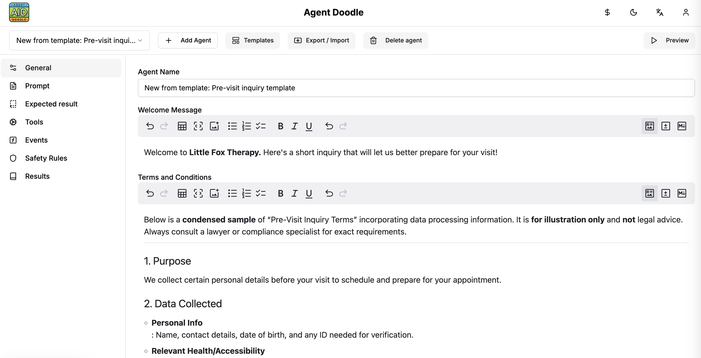

<div style="text-align: center"></div>

## Empathetic Chatbot Agents from a single prompt!

Agent Doodle let you create a **dynamic and empathetic chatbot agents**, that:
- 🎯 are focused on the goal, **dynamically setting the questions based on previous answers**!
- 👩‍💼 are **empathetic** - the conversation is managed by AI, using the tone of voice you set for the agent,
- 💾 collects data in any format you request (**JSON, markdown etc.**),
- 💵 can sell things,
- ✏️ can collect the **leads** or save them in external CRM,
- 📆 can **schedule calendar events** that fits all the participiants,
- 🛠️ are able to call all set of tools - sending e-mails, accessing calendar, external CRM's, data sources etc.

**Create an agent, get a unique link, send it to the users or share on your webpage!**

It can literally replace dozen other SaaS tools like:
- CRM,
- Calendar / Scheduler,
- Google Forms / Typeform etc.,
- Support agents,
- Chatbots,
- Feedback forms,
- NPS software,

## Screenshots

<table>
    <tr>
        <td>
            <a href=".readme-assets/screenshot-1.png">
                
            </a>
        </td>
        <td>
            <a href=".readme-assets/screenshot-2.png">
                
            </a>      
        </td>
        <td>
            <a href=".readme-assets/screenshot-3.png">
                
            </a>      
        </td>
    </tr>
    <tr>
        <td>
            <a href=".readme-assets/screenshot-4.png">
                
            </a>
        </td>
        <td>
            <a href=".readme-assets/screenshot-5.png">
                
            </a>      
        </td>
        <td>
            <a href=".readme-assets/screenshot-6.png">
                
            </a>      
        </td>
    </tr>
</table>    

## Features

- **Create new agents and polls** just based on your text description it takes 20s to create your first inquiry!
- **Chat for the end users** send unique link t ousers to get the results,
- **Event/action flows** - to dynamically react for user answers,
- **Output formatting** - dynamic output formatting to any text / object format (XML, JSON, Markdown),
- **Import/Export** agents,
- **Import/Export** agent results,
- **Browse results** - including Chat with the results for instantly getting summaries etc,
- **Browse sessions** - check the interactions and chat history between your agents and end-users,
- **Security constrains** - Set the safety net around the agents (of which they should never ask, remove PII etc)
- **Tools** - extensible tools framework so the agent can send e-mails, Slack messages, export data to systems like CRM etc.
- **Templates** - including ready-made templates like CRM app, pre-visit inquiry etc.

## Use cases

Agent Doodle is a very simple tool you can run on your own or use the [hosted version](https://agentdoodle.com). 

### Pre-visit inquiries

Share the link of the Agent with your patient/customers no matter if you are a medicine doctor either physio-terapist, trainer etc. The results will let you **save tons of time** preparing for the visit.

### Scheduling 

Tired of using **Calendly** or **Cal.com**? Send them the agent which will let the users schedule calls with you based on your availability + already scheduled events.

### Collecting user feedback

Add a widget to your website with a link to Agent which will ask 2-3 questions to get the users feedback, notify you on e-mail once they got it and store in a database for further analytics.

### NPS and e-NPS

Agent Doogle is great for checking the Net Promoter Score. Create an Agent, send a link to your employees (eNPS) or customers (NPS) - use the "Chat with the results" feature to calculate the NPS dynamically on the spot!

## Getting started

Agent Doodle has literally no external dependencies. If you like to run it locally or **contribute** please just execute the following commands:

```bash
git clone https://github.com/CatchTheTornado/agent-doodle
export OPENAI_API_KEY=sk-proj-.... # your API key from https://openai.com
cd agent-doodle
yarn
yarn dev
```

That's it! Now you can get open your browser and navigate to: https://localhost:3000

## License

Agent Doodle is released under [MIT](LICENSE) license.
