<p align="center"></p>

## Build AI Assistants for Bookings, Intake forms, Orders, Support ....

Agent Doodle let you create interactive AI agents that:
- 💵 can sell things on Instagram,
- 🛠️ can configure sophisticated products (CPQ),
- 💁‍♀️ automates your Company and **saves you tons of time** and money otherwise spend on assisting personel,
- 🎯 are focused on the goal, **dynamically setting the questions based on previous answers**!
- 👩‍💼 are **empathetic** - the conversation is managed by AI, using the tone of voice you set for the agent,
- 📆 can **book calendar events** that fits all the participiants,
- 💾 collects data in any format you request (**JSON, markdown etc.**),
- ✏️ can collect the **leads** or save them in external CRM,
- 🛠️ are able to call all set of tools - sending e-mails, accessing calendar, external CRM's, data sources etc.

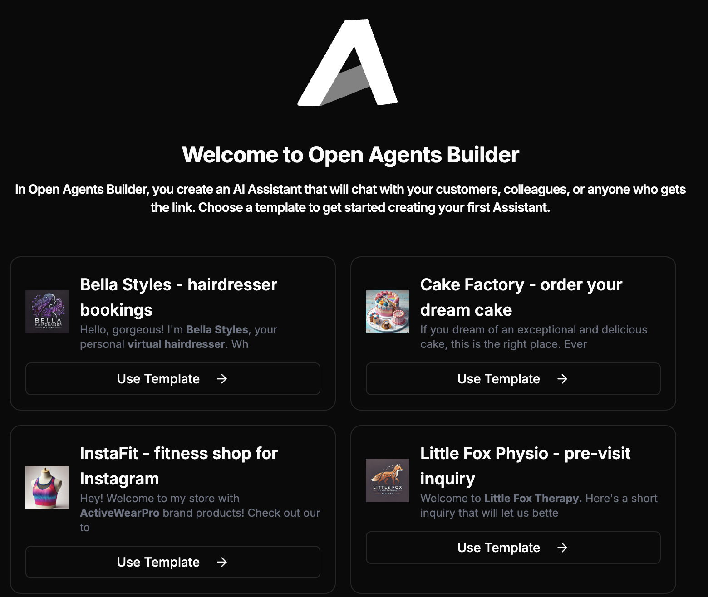

**Create an agent, get a unique link, send it to the users or share on your webpage!**

It can literally replace dozen other SaaS tools like:
- eCommerce,
- B2B,
- CPQ,
- Booking software,
- CRM,
- Calendar / Scheduler,
- Google Forms / Typeform etc.,
- Support agents,
- Chatbots,
- Feedback forms,
- NPS software.

## Screenshots

<table>
    <tr>
        <td>
            <a href=".readme-assets/screenshot-17.png">
                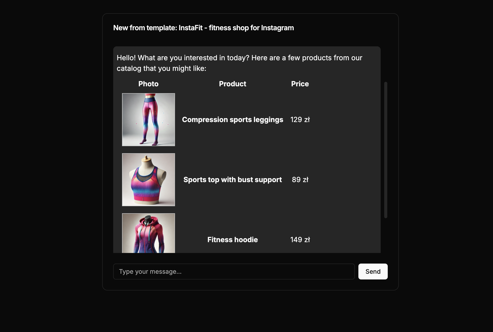
            </a>
        </td>
        <td>
            <a href=".readme-assets/screenshot-18.png">
                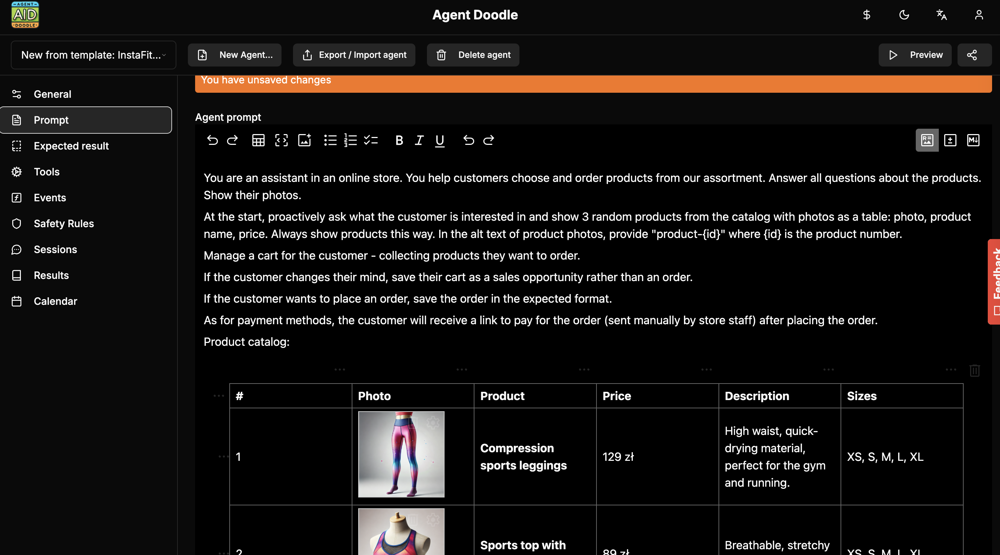
            </a>      
        </td>
        <td>
            <a href=".readme-assets/screenshot-19.png">
                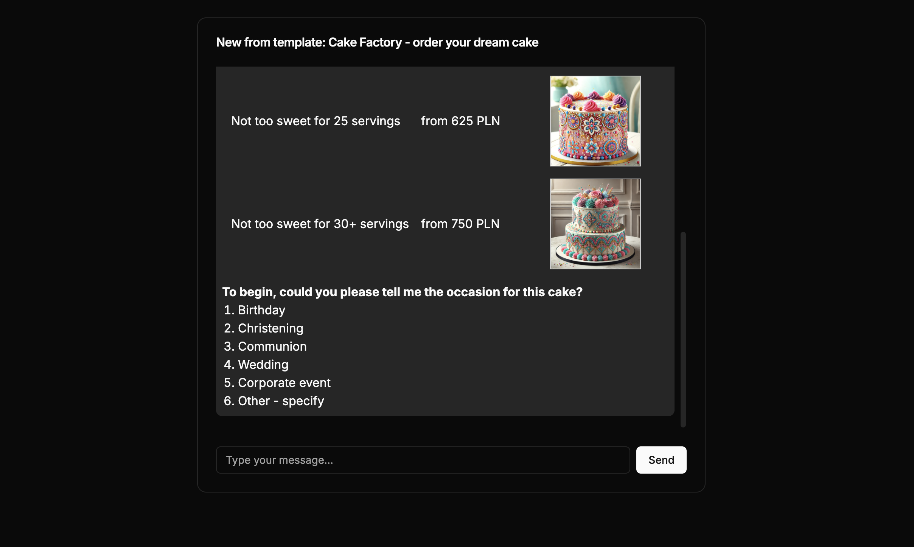
            </a>      
        </td>
    </tr>
    <tr>
        <td>
            <a href=".readme-assets/screenshot-20.png">
                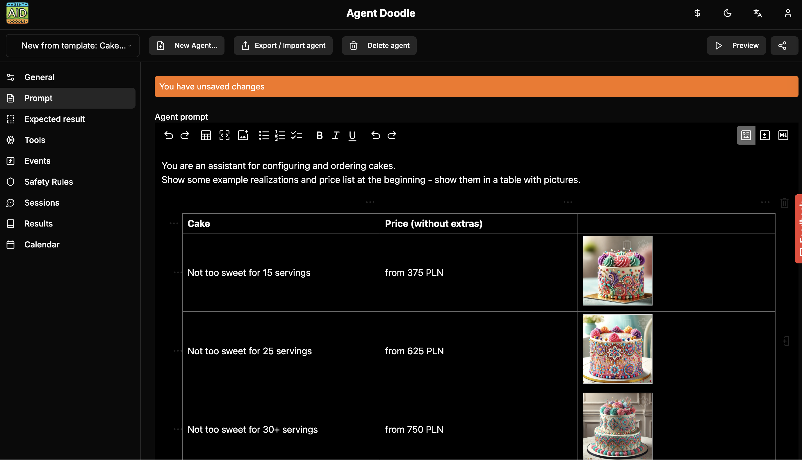
            </a>
        </td>
        <td>
            <a href=".readme-assets/screenshot-11.png">
                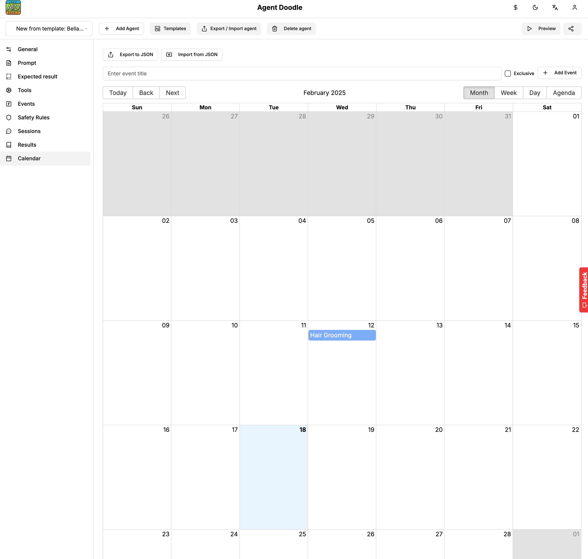
            </a>      
        </td>
        <td>
            <a href=".readme-assets/screenshot-9.png">
                
            </a>      
        </td>
    </tr>
    <tr>
        <td>
            <a href=".readme-assets/screenshot-12.png">
                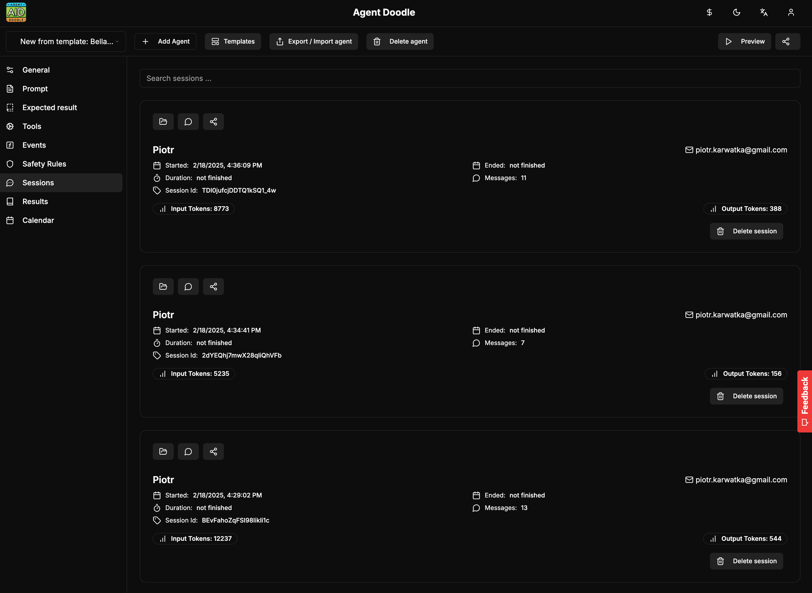
            </a>
        </td>
        <td>
            <a href=".readme-assets/screenshot-14.png">
                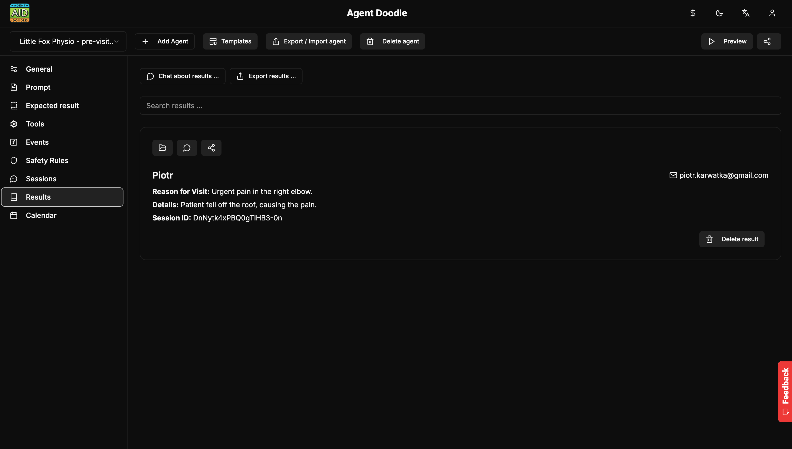
            </a>      
        </td>
        <td>
            <a href=".readme-assets/screenshot-15.png">
                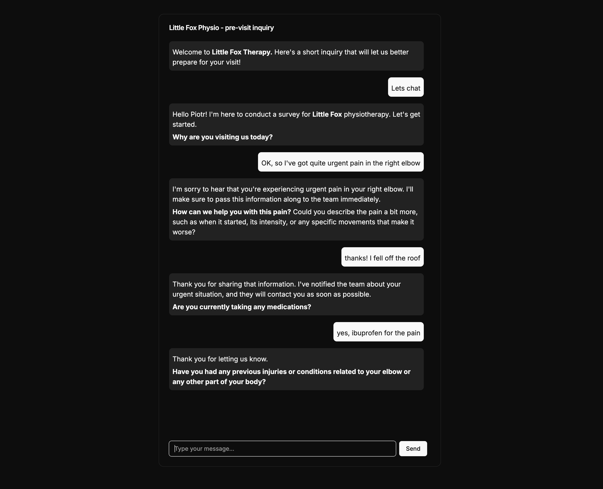
            </a>      
        </td>
    </tr>
    <tr>
        <td>
            <a href=".readme-assets/screenshot-13.png">
                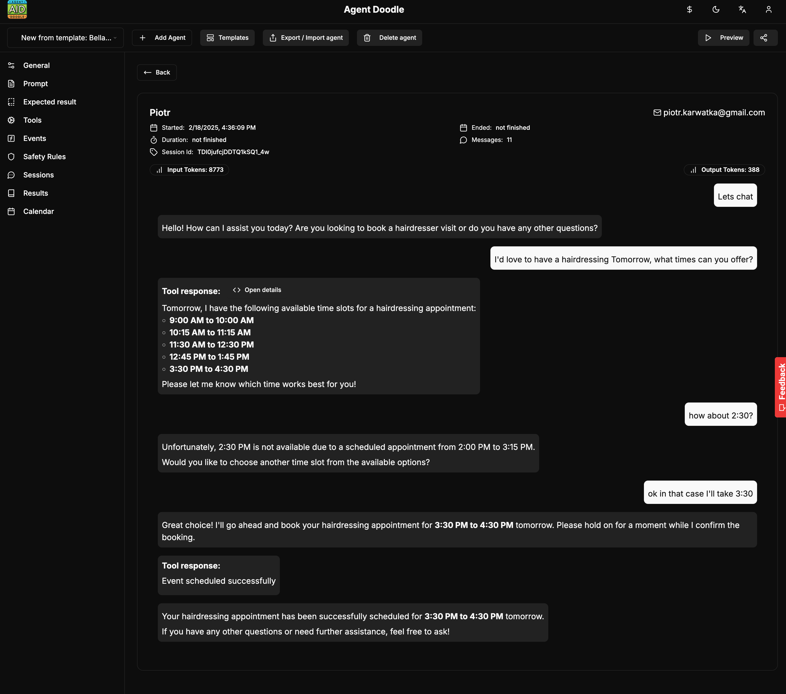
            </a>
        </td>
        <td>
            <a href=".readme-assets/screenshot-2.png">
                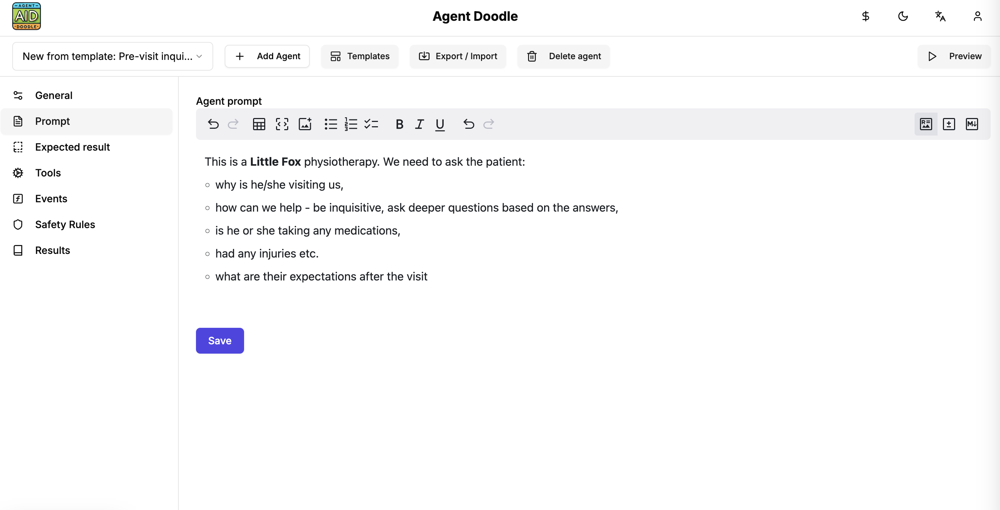
            </a>      
        </td>
        <td>
            <a href=".readme-assets/screenshot-3.png">
                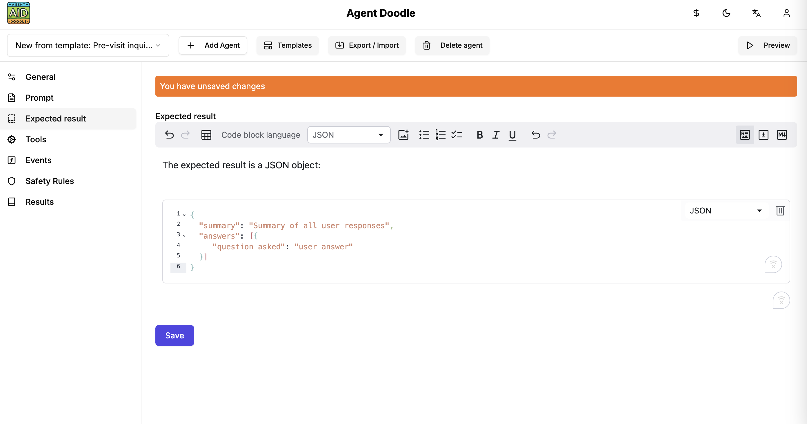
            </a>      
        </td>
    </tr>
    <tr>
        <td>
            <a href=".readme-assets/screenshot-4.png">
                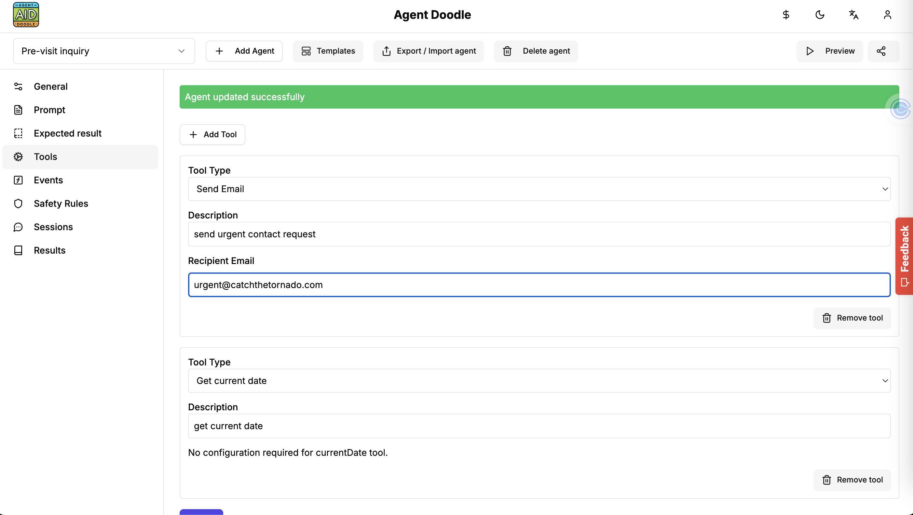
            </a>
        </td>
        <td>
            <a href=".readme-assets/screenshot-5.png">
                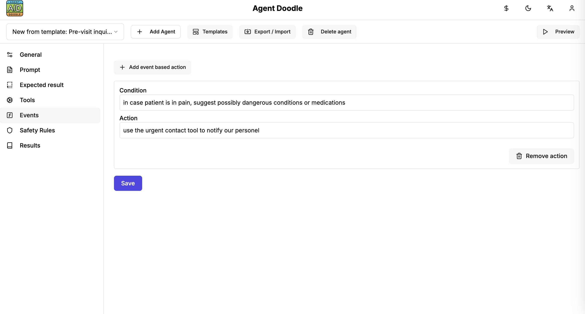
            </a>      
        </td>
        <td>
            <a href=".readme-assets/screenshot-1.png">
                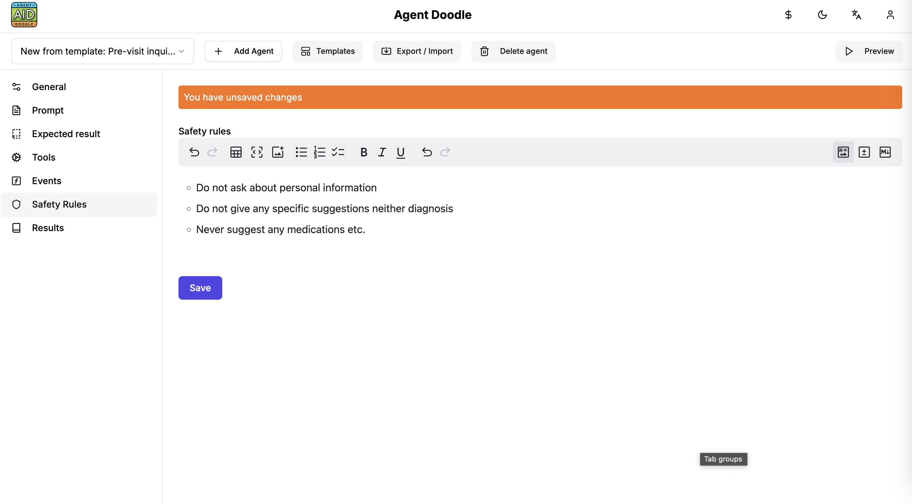
            </a>      
        </td>
    </tr>
</table>    

## Features

- **Create new agents and polls** just based on your text description it takes 20s to create your first inquiry!
- **Chat for the end users** send unique link t ousers to get the results,
- **Event/action flows** - to dynamically react for user answers,
- **Output formatting** - dynamic output formatting to any text / object format (XML, JSON, Markdown),
- **Import/Export** agents,
- **Import/Export** agent results,
- **Browse results** - including Chat with the results for instantly getting summaries etc,
- **Browse sessions** - check the interactions and chat history between your agents and end-users,
- **Security constrains** - Set the safety net around the agents (of which they should never ask, remove PII etc)
- **Tools** - extensible tools framework so the agent can send e-mails, Slack messages, export data to systems like CRM etc.
- **Templates** - including ready-made templates like CRM app, pre-visit inquiry etc.

## Businesses supported by Agent Doodle

Below is a list of industries that have a genuine need for both scheduling appointments and gathering additional data, yet are not as heavily “covered” by popular booking tools. No beating around the bush:

1. **💈 E-Commerce, Social commerce** 
   - *Examples:* Selling things on Instagram  
   - *Why?* You probably need a simple eCommerce. With Agent Doodle you may create a whole eCommerce under a single link that you paste into your Instagram profile. Moreover it will answer user questions and let them customize the products!

2. **🔧 B2B, CPQ, Qutation Engine** 
   - *Examples:* Negotiating quotes or configuring very complex products
   - *Why?* Your Sales team probably spend hours on calls with customers. Now you can outsource it to Agent Doodle generated agent. Provide it with all the products, your negotiation strategies and its gonna do the reset finalizing with the order. Great for made-for-order use cases!

3. **👩‍💻 Workshops and Thematic Courses**  
   - *Examples:* Cooking classes, painting, sewing, or coding courses for kids.  
   - *Why?* Instructors often need to know the participant’s skill level, preferences (e.g., diet, tools, materials). Quickly gathering details and setting a date is a perfect job for a chat assistant.

4. **🖨️ Home Appliance Repair Services (AGD, RTV, Computers)**  
   - *Examples:* Washing machine, laptop, and TV repairs.  
   - *Why?* There are always questions about the model, serial number, type of fault, and then scheduling a technician’s visit. It’s best to handle all of this in one efficient process.

5. **👩‍🏫 Training and Consulting Firms**  
   - *Examples:* Marketing consultations, workplace safety (BHP) training, communication workshops.  
   - *Why?* They often need to gather a brief, determine the number of participants, and understand expectations. A chat-based system that schedules directly into a calendar is a game-changer.

6. **🗒️ Legal and Tax Advisory Services**  
   - *Examples:* Small law firms, accounting offices.  
   - *Why?* Before taking on a case, a lawyer or accountant needs key details—case type, documents, deadlines. Instead of endless emails, a quick chat session can collect this info and schedule a meeting instantly.

7. **🏠 Real Estate Agencies**  
   - *Examples:* Agencies handling apartment, house, or commercial property sales.  
   - *Why?* How often does an agent ask: “What’s your budget?” “Are you looking for a fixer-upper or a move-in-ready home?”—over and over again. Embedding these questions into an automated chat + a scheduling system will streamline the process and save everyone’s nerves.

8. **📁 Technical Consulting Services (e.g., Interior Designers, Architects)**  
   - *Examples:* Interior designers, landscape architects, installation planners.  
   - *Why?* Before starting work, such a specialist needs to know things like square footage, aesthetic preferences, and budget. A chatbot with an automated scheduler eliminates countless phone calls and emails.

9. **🚕 Automotive Services (Beyond Standard Car Repair Shops)**  
   - *Examples:* Mobile tire service, upholstery cleaning, car detailing.  
   - *Why?* Customers need to provide details like license plate numbers, service type, vehicle condition. Then there’s the scheduling—do they prefer morning or evening? All of it can be handled in one place.

10. **👨🏻‍🏫 Language Schools and Private Tutors**  
   - *Examples:* Group language courses, one-on-one online lessons.  
   - *Why?* Skill level, learning goals (business, hobby, exam prep), preferred times—these details fit perfectly into an automated chat with a scheduling system.

11. **🎉 Event Organizers (e.g., Photo Sessions, Shows, Corporate Events)**  
   - *Examples:* Photography studios, corporate event planners.  
   - *Why?* Organizing an event requires coordinating many details—number of attendees, catering, location, needed equipment. A chat system with automatic booking and data collection reduces the chaos.

12. **🪑 Mobile On-Site Services**  
   - *Examples:* Mobile car washes, mobile pet grooming, bike repair at the client’s location.  
   - *Why?* They require scheduling an address, time, and sometimes details like the type of equipment or pet breed. A short chat survey—and voila, appointment confirmed.


These industries share a common challenge: before an appointment happens, key client information needs to be collected. Doodle Agent can solve two problems at once—automating information gathering and scheduling visits, saving time, stress, and gallons of coffee. Sound like a plan? Absolutely!

## Use Cases 

Agent Doodle is a very simple tool you can run on your own or use the [hosted version](https://agentdoodle.com). 

### E-commerce

You may list your products (with prices, variants, photos) and let the users configure and select what they're interested in. The agent will gather all required data, maintain the shopping cart and finalize with order!

### Made to Order, CPQ

Complex products are very difficult for users to configure. You may create an agent which is instructed how to configure the products based on even super-complex specs. Let it do the work for your users and for you - finalizing with a Quote or an Order!

### Booking

Use the Calendar module to let the users sign up for your services finding the most convinient time slots. Collect leads!

### Pre-visit inquiries

Share the link of the Agent with your patient/customers no matter if you are a medicine doctor either physio-terapist, trainer etc. The results will let you **save tons of time** preparing for the visit.

### Scheduling 

Tired of using **Calendly** or **Cal.com**? Send them the agent which will let the users schedule calls with you based on your availability + already scheduled events.

### Collecting user feedback

Add a widget to your website with a link to Agent which will ask 2-3 questions to get the users feedback, notify you on e-mail once they got it and store in a database for further analytics.

### NPS and e-NPS

Agent Doogle is great for checking the Net Promoter Score. Create an Agent, send a link to your employees (eNPS) or customers (NPS) - use the "Chat with the results" feature to calculate the NPS dynamically on the spot!

### Supporting users

Automatically answer all the users questions + use the event based actions to react for business critical situations (like potential lead etc)

## Getting started

Agent Doodle has literally no external dependencies. If you like to run it locally or **contribute** please just execute the following commands:

```bash
git clone https://github.com/CatchTheTornado/agent-doodle
export OPENAI_API_KEY=sk-proj-.... # your API key from https://openai.com
cd agent-doodle
yarn
yarn dev
```

That's it! Now you can get open your browser and navigate to: https://localhost:3000

## License

Agent Doodle is released under [MIT](LICENSE) license.
